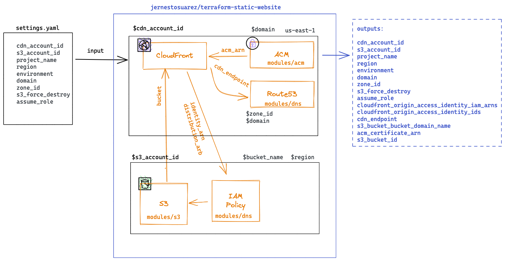

# CloudFront with separate S3 and DNS

This an example how to deploy a static site with CloudFront.

Assuming you have some kind of governance implemented withing your organization, with the default values you can use it safely if you have implemented Control Tower with the default roles and also allow custom AssumeRoles.

The solution needs to be executed from your governance AWS Account where you are allowed to assume the control for the following accounts / resources
 - CDN account: Access to CloudFront, ACM and Route53
 - S3 account: Access to S3 and IAM

The solution develops resources with the folowing schema 



# Use

1. Configure your settings.yaml
2. Configure your backend.conf where to store the state of this deployment
   1. If you want to avoid this step and create initial state CIs automatically you can use Terragrunt. Take a look to the terragrunt branch to know how to do it.
3. Ensure you have an index.html in your bucket. You can use the sample files in modules/s3/html

```
terraform init -backend-config=backend.conf && terraform plan && terraform apply
```

# Inputs

| Name | Description | Type | Default | Required |
|------|-------------|------|---------|:--------:|
|cdn\_account\_id  | AccountID where the CDN must be created | String | None | true |
|s3\_account\_id | AccountID where the S3 bucket must be created  | String | None | true |
|project\_name | Name of the project to generate some random strings related to it  | String | None | true |
|region | Region for the S3 related stuff. The CDN will be deployed on North Virginia  | String | eu-west-1 | true |
|environment | Environment for this deployment, the bucket and some random tags and strings will have it attached  | String | dev | true |
|domain | FQDN for deploying this site  | String | None | true |
|zone\_id | Zone ID for the ROUTE53 hosting the domain zone. This route 53 lives in the same account than the ACM and the CDN  | Boolean | None | true |
|s3\_force\_destroy | Destroy protection for the s3 bucket. Put it to true in case you want to destroy the content of the bucket when this resource is deleted  | String | None | true |
|assume\_role | The name of the role used in your multi-account governance policy. By default AWSControlTowerExecution compatible with AWS Control Tower environments with or without AFT  | String | AWSControlTowerExecution | true |

## Outputs

| Name | Description |
|------|-------------|
|cdn\_account\_id |  AccountID where the CDN must be created |
|s3\_account\_id |  AccountID where the S3 bucket must be created |
|project\_name |  Name of the project to generate some random strings related to it |
|region |  Region for the S3 related stuff. The CDN will be deployed on North Virginia |
|environment |  Environment for this deployment, the bucket and some random tags and strings will have it attached |
|domain |  FQDN for deploying this site |
|zone\_id |  Zone ID for the ROUTE53 hosting the domain zone. This route 53 lives in the same account than the ACM and the CDN |
|s3\_force\_destroy |  Destroy protection for the s3 bucket. Put it to true in case you want to destroy the content of the bucket when this resource is deleted |
|assume\_role |  The name of the role used in your multi-account governance policy. By default AWSControlTowerExecution compatible with AWS Control Tower environments with or without AFT |
|cloudfront\_origin\_access\_identity\_iam\_arns |  The IAM arns of the origin access identities created |
|cloudfront\_origin\_access\_identity\_ids |  The IDS of the origin access identities created |
|cdn\_endpoint |  Endpoint generated by the CDN |
|s3\_bucket\_bucket\_domain\_name |  DNS for generated S3 Bucket |
|acm\_certificate\_arn |  ACM certificate ARN for this domain |
|s3\_bucket\_id |  ID for generated S3 Bucket |
# DRY Statement

Using high quality OSS modules provide tested solutions among other multiple benefits.